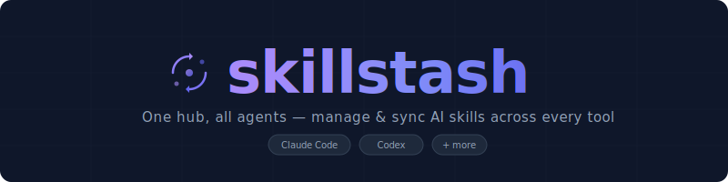

<p align="center">
  
</p>

<p align="center">
  <a href="https://github.com/Duducoco/skillstash/actions/workflows/ci.yml">
    
  </a>
  <a href="https://github.com/Duducoco/skillstash/releases">
    
  </a>
  <a href="https://www.npmjs.com/package/skillstash">
    
  </a>
  <a href="https://github.com/Duducoco/skillstash/blob/main/LICENSE">
    
  </a>
</p>

<p align="center">
  一个 Hub，所有 Agent。将你的 AI Agent skill 集中管理在一个 git 仓库中，同步到 Cursor、Gemini、Codex、Claude Code 等。
</p>

<p align="center">
  <a href="./README.md">English</a> | <a href="./README_zh.md">中文</a>
</p>

---

## 📦 概述

skillstash 是一个 CLI 工具，将你的所有 AI Agent skill 集中存放在一个 git 托管的 Hub 中。从 ClawHub、GitHub 或本地路径安装 skill，由 skillstash 负责将它们复制到每个 Agent 目录。一台机器拉取，所有设备同步。

```
~/.skillstash/skills-hub/ (git) ← 唯一可信来源
 ┌──────────────────────────┐
 │     registry.json  (git) │  ← skill 元数据（跨设备共享）
 ├──────────────────────────┤
 │     local.json (ignored) │  ← Agent 配置与分配（本设备专属）
 └──────────────────────────┘
 ┌──────────────────────────┐
 │     skills/              │
 │       finance-ops/       │
 │       anti-distill/      │
 │       my-custom-skill/   │
 └──────────────────────────┘
          │  skillstash link（复制）
    ┌─────┼──────┬──────────┐
    ▼     ▼      ▼          ▼
 Gemini  Codex  Claude    Cursor
 skills/ skills/ skills/ skills/
```

**设计原则：**
- **默认复制** — 最大化兼容性，在 Windows 上无需处理符号链接权限问题
- **Git 托管** — 版本控制、多设备同步、冲突解决，开箱即用
- **Agent 无关** — 自动检测已安装的 Agent；支持通过 `agents add` 注册自定义 Agent
- **本地优先，远端可选** — `init` 无需 Git 远端即可运行，之后可用 `add-remote` 添加远端

## 🚀 快速开始

```bash
# 全局安装
npm install -g skillstash

# 1a. 初始化本地 Hub（无需 Git 远端）
skillstash init
# → 交互式提示：选择语言，选择要管理的 Agent

# 1b. 或携带远端地址初始化，开启多设备同步
skillstash init git@github.com:yourname/my-skills.git

# 1c. 已有本地 Hub？之后再绑定远端
skillstash add-remote git@github.com:yourname/my-skills.git

# 2. 安装 skill（从 ClawHub、GitHub 或本地路径）
skillstash install clawhub:finance-ops
skillstash install owner/repo@skill-name   # GitHub
skillstash install ./my-local-skill         # 本地路径

# 3. 从 Agent 目录导入已有 skill
skillstash import --force   # --force 覆盖已存在的 skill

# 4. 链接（复制）到所有 Agent 目录
skillstash link

# 5. 完整同步 — 拉取 + 校验 + 链接 + 推送
skillstash sync
```

## 🔄 多设备同步

skillstash 通过共享 Git 远端支持多设备同步。远端是**可选的** — 可以先在本地使用，之后再添加。

```bash
# 设备 A（先在本地初始化）
skillstash init
# → 创建本地 Hub，导入 skill

# 之后绑定远端
skillstash add-remote git@github.com:yourname/my-skills.git

# 设备 B（克隆已有 Hub）
skillstash init git@github.com:yourname/my-skills.git
# → 克隆 Hub，导入本地独有 skill，推送合并结果

# 任意设备的日常使用
skillstash sync    # 拉取 + 校验 + 链接 + 推送
```

### ⚙️ 冲突解决

`skillstash sync` 会自动处理合并冲突，大多数情况下无需人工干预。

**工作原理：**

当两台设备分别安装或修改了 skill，`sync` 使用智能三路合并代替普通的 `git pull`：

1. `git fetch` — 下载远端变更，不修改本地文件
2. 若双方均有新提交，skillstash 在应用层对 `registry.json` 执行合并：
   - **`updatedAt` 更新的一方获胜**，当同一 skill 在两端均被修改时
   - 远端新增的 skill 会被合并；本地新增的 skill 会被保留
   - 一端删除的 skill 会被尊重，除非另一端在删除之后对其进行了修改
3. skill 目录中的文件冲突会根据相同的 registry 决策自动解决
4. 创建合并提交，sync 正常继续

**本地未提交的改动**会在 fetch 之前自动提交，不会有任何丢失风险。

**如果 Hub 卡在 MERGING 状态**（例如上次 sync 中途中断）：

```bash
cd ~/.skillstash/skills-hub && git merge --abort
# 然后重新运行：
skillstash sync
```

## 📖 命令参考

### `skillstash init [remote-url]`

使用远端 Git 仓库初始化 skills-hub。Hub 始终位于 `~/.skillstash/skills-hub`。

初始化时会提示选择显示语言（English / 中文），以及要管理的 Agent，使用方向键导航，空格切换选中状态，回车确认。之后可通过 `skillstash agents` 修改。

完成 Agent 选择和 skill 导入后，会询问是否立即运行 `link` — 这会将 Hub 中的所有 skill 复制到已管理的 Agent 目录，使其立即可用。

远端 URL **可选**。不填则创建本地 Hub，之后可用 `add-remote` 绑定远端。

| 远端状态 | 行为 |
|---|---|
| **无 URL（本地模式）** | 本地创建 Hub → 选择语言 → 选择 Agent → 自动导入已有 skill → 提示 link |
| **空仓库** | 本地创建 Hub → 选择语言 → 选择 Agent → 自动导入已有 skill → 提示 link → git push |
| **非空且含 `registry.json`** | 克隆 Hub → 选择语言 → 选择 Agent → 重新检测本地 Agent → 导入本地新 skill → 提示 link → git push |
| **非空但无 `registry.json`** | ❌ 拒绝 — 非 skillstash 仓库，提示创建新的空仓库 |

```bash
skillstash init                                         # 本地 Hub
skillstash init git@github.com:yourname/my-skills.git
skillstash init https://github.com/yourname/my-skills.git
```

### `skillstash add-remote <remote-url>`

将已有的本地 Hub 绑定到 Git 远端并推送。适用于先用 `skillstash init`（不带 URL）创建本地 Hub 后，再决定启用多设备同步的场景。

```bash
skillstash add-remote git@github.com:yourname/my-skills.git
skillstash add-remote https://github.com/yourname/my-skills.git
```

### `skillstash install <source>`

从 ClawHub、本地路径或 GitHub 仓库安装 skill。

```bash
skillstash install clawhub:finance-ops         # 从 ClawHub（需要 clawhub CLI）
skillstash install ./my-local-skill            # 从本地路径
skillstash install owner/repo@skill-name       # 从 GitHub
skillstash install clawhub:finance-ops --no-lint # 跳过 SKILL.md 校验
```

**ClawHub 集成**需要安装并登录 `clawhub` CLI：
```bash
npm install -g clawhub
clawhub login
```

**GitHub 安装**支持三种仓库结构：
- 独立 skill 仓库：`SKILL.md` 位于仓库根目录
- skill-hub 仓库：`skills/<name>/SKILL.md`
- 子目录 skill：`<name>/SKILL.md`

未指定 `@skill-name` 的多 skill 仓库会弹出选择提示。

### `skillstash import`

扫描 Agent 目录（自动解析符号链接/Junction），将 skill 导入 Hub。

```bash
skillstash import                  # 从所有 Agent 导入
skillstash import --agent claude   # 只从指定 Agent 导入
skillstash import --force          # 重新导入已存在的 skill（覆盖）
skillstash import --dry-run        # 预览，不实际修改
skillstash import --no-lint        # 跳过 SKILL.md 校验
```

### `skillstash link`

将 skill 从 Hub 复制到所有 Agent 目录。

```bash
skillstash link                     # 链接所有 skill 到所有 Agent
skillstash link --agent workbuddy   # 只链接到指定 Agent
skillstash link --skill finance-ops # 只链接指定 skill
skillstash link --clean             # 删除 Agent 目录中不在 Hub 里的 skill
```

### `skillstash list`

列出已安装的 skill 及其在各 Agent 中的状态。

```bash
skillstash list                    # 概览
skillstash list -v                 # 显示详细描述
```

### `skillstash sync`

完整同步：git pull → 校验完整性 → 链接到 Agent → git push。

```bash
skillstash sync                    # 完整同步
skillstash sync --no-pull          # 跳过 git pull
skillstash sync --no-push          # 跳过 git push
skillstash sync --no-link          # 跳过链接
skillstash sync --clean            # 删除不在 Hub 中的 skill
```

### `skillstash diff`

对比 Hub 与 Agent 目录之间的差异。

```bash
skillstash diff                    # 对比所有 Agent
skillstash diff --agent workbuddy  # 只对比指定 Agent
```

### `skillstash remove <skill-name>`

从 Hub 及所有 Agent 目录中删除 skill。

```bash
skillstash remove old-skill              # 从所有地方删除
skillstash remove old-skill --keep-agents  # 只从 Hub 删除
```

### `skillstash agents`

管理 skillstash 同步的 Agent 列表。只有已启用的 Agent 才会在 `link` 和 `sync` 时接收 skill。

```bash
skillstash agents list              # 显示所有 Agent 的可用/管理状态
skillstash agents select            # 交互式选择要管理的 Agent
skillstash agents enable claude     # 启用指定 Agent
skillstash agents disable codex     # 禁用 Agent（link/sync 时跳过）
skillstash agents add <name> --path <skills-path>   # 注册自定义 Agent
skillstash agents remove <name>     # 注销自定义 Agent（内置 Agent 不可移除）
```

`select` 子命令与 `init` 使用相同的交互式复选框界面 — 方向键导航，空格切换，回车确认。快捷键：`a` 全选，`i` 反选。

**自定义 Agent** 通过 `agents add` 注册，保存在 `local.json`（设备本地）。内置 Agent 不可移除，只能启用/禁用。

### `skillstash language`

更改所有 CLI 输出的显示语言，设置保存到 `local.json` 并在之后的每次命令中自动生效。

```bash
skillstash language    # 交互式提示：English / 中文
```

语言也可在 `skillstash init` 时选择。

### `skillstash assign`

为**当前设备**上的每个 Agent 单独配置接收哪些 skill，与其他设备完全独立。

```bash
skillstash assign                   # 配置所有已启用的 Agent
skillstash assign --agent claude    # 只配置指定 Agent
```

运行后会为每个 Agent 打开复选框提示，默认勾选上次的配置（首次运行则全选）。确认后可选择立即执行 `link` 应用变更。

配置保存在 `local.json`（已加入 .gitignore）中，每台设备完全独立。没有显式配置的 Agent 会继续接收所有全局启用的 skill — 这是纯增量的新能力，不影响现有用法。

**示例：不同设备使用不同 skill**

```bash
# 在工作站：claude 只接收编码工具
skillstash assign --agent claude
# → 选择：git-commit、finance-ops

# 在写作机器：claude 只接收文档工具
skillstash assign --agent claude
# → 选择：document-pdf、citation-management
```

两台机器共享同一个 Hub，同步相同的 skill 文件，只有分配关系不同。

## 🤖 支持的 Agent

| Agent | skill 目录 | 自动检测 |
|---|---|:---:|
| Claude Code | `~/.claude/skills/` | ✅ |
| Codex CLI | `~/.codex/skills/` | ✅ |
| Gemini CLI | `~/.gemini/skills/` | ✅ |
| Cursor | `~/.cursor/skills-cursor/` | ✅ |
| Kilo Code | `~/.kilocode/skills/` | ✅ |
| TRAE（字节跳动） | `~/.trae/skills/` | ✅ |
| Qoder（阿里巴巴） | `~/.qoder/skills/` | ✅ |
| CodeBuddy（腾讯） | `~/.codebuddy/skills/` | ✅ |
| Kimi Code | `~/.config/agents/skills/` | ✅ |
| OpenClaw | `~/.openclaw/skills/` | ✅ |
| Vercel Skills | `~/.agents/skills/` | ✅ |
| OpenCode | `~/.opencode/skills/` | ✅ |
| AntiGravity | `~/.gemini/antigravity/skills/` | ✅ |
| Codes CLI | `~/.codes/skills/` | ✅ |
| iFlow CLI | `~/.iflow/skills/` | ✅ |

所有 Agent 均自动检测，可通过 `skillstash init` 或 `skillstash agents select` 选择要管理的 Agent。禁用的 Agent 仍会被检测到，但在 `link` 和 `sync` 时会被跳过。

## 🗂️ 数据结构

Hub 将状态分存于两个文件：

| 文件 | Git 跟踪 | 内容 |
|---|:---:|---|
| `registry.json` | ✅ | skill 元数据：名称、版本、哈希、来源 URL |
| `local.json` | ❌ | Agent 配置、skill 分配、上次同步时间 |

`local.json` 由 skillstash 自动加入 Hub 的 `.gitignore`，彻底消除了设备专属状态引发的合并冲突，同时为 `assign` 命令提供了独立的存储空间。

**`registry.json`**（跨设备共享）：

```json
{
  "version": "1.0",
  "skills": {
    "finance-ops": {
      "version": "1.0.0",
      "source": "github",
      "sourceUrl": "https://github.com/owner/repo",
      "hash": "sha256:abc123...",
      "enabled": true,
      "description": "AI CFO 助手",
      "installedAt": "2026-04-24T12:00:00Z",
      "updatedAt": "2026-04-24T12:00:00Z"
    }
  }
}
```

**`local.json`**（本设备专属，不纳入 git）：

```json
{
  "lastSync": "2026-04-24T12:00:00Z",
  "language": "zh",
  "agents": {
    "claude": {
      "name": "claude",
      "skillsPath": "~/.claude/skills",
      "linkType": "copy",
      "available": true,
      "enabled": true
    }
  },
  "agentSkills": {
    "claude": ["finance-ops", "git-commit"]
  },
  "customAgents": [
    {
      "name": "my-agent",
      "skillsPath": "/custom/path/to/skills",
      "linkType": "copy"
    }
  ]
}
```

## 🏗️ 项目结构

```
skillstash/
├── src/
│   ├── index.ts              # CLI 入口
│   ├── commands/
│   │   ├── agents.ts         # skillstash agents
│   │   ├── assign.ts         # skillstash assign
│   │   ├── init.ts           # skillstash init [remote-url]
│   │   ├── add-remote.ts     # skillstash add-remote <url>
│   │   ├── install.ts        # skillstash install
│   │   ├── link.ts           # skillstash link
│   │   ├── list.ts           # skillstash list
│   │   ├── sync.ts           # skillstash sync
│   │   ├── diff.ts           # skillstash diff
│   │   ├── remove.ts         # skillstash remove
│   │   ├── import.ts         # skillstash import
│   │   └── language.ts       # skillstash language
│   ├── core/
│   │   ├── agents.ts         # 内置 Agent 定义与插件 API
│   │   ├── registry.ts       # Registry 类型与操作
│   │   ├── hub.ts            # Hub 目录管理
│   │   ├── git.ts            # Git 操作
│   │   ├── merge.ts          # 三路 registry 合并
│   │   └── skill.ts          # SKILL.md 解析与校验
│   ├── i18n/
│   │   ├── index.ts          # 语言管理
│   │   ├── en.ts             # 英文字符串
│   │   └── zh.ts             # 中文字符串
│   └── utils/
│       ├── fs.ts             # 文件系统工具
│       ├── lock.ts           # 文件锁（防止并发写冲突）
│       ├── logger.ts         # 彩色日志，含 spinner 与进度计数
│       └── prompt.ts         # 交互式提示（复选框）
├── docs/
│   └── images/               # 资源文件
├── package.json
├── tsconfig.json
└── README.md
```

## 🛠️ 开发

```bash
# 安装依赖
npm install

# 构建
npm run build

# 本地运行
node dist/index.js --help

# 监听模式
npm run dev
```

## 📄 许可证

MIT
